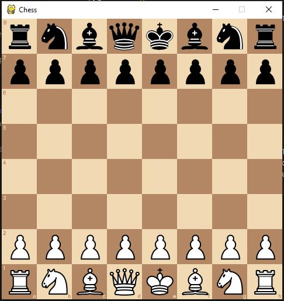
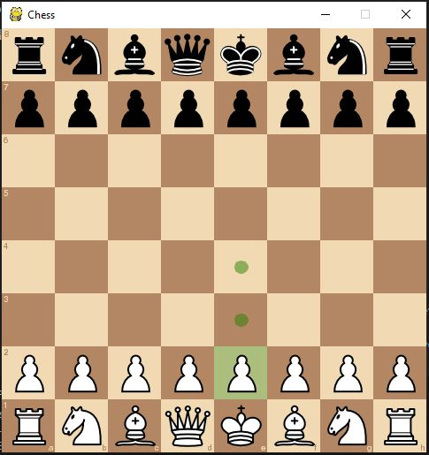
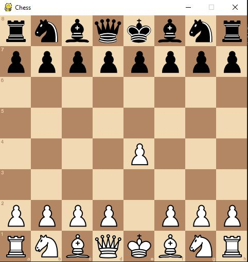

# Chess

This is a local multiplayer chess in python using pygame. All of the rules of chess applies in this game (Castling, en passant, stalemate)

## Setup

Install required packages  
```$ pip install pygame```  
 OR  
```$ pip install -r requirements.txt```
  
  
The game can be played by first executing the main.py file  
```$ python main.py```

## Game

The board will then be displayed on screen, with white to move first  


To move the piece, click on the piece you want to move.
The piece will be higlighted in green and the legal moves of then piece will be displayed  


Click on the square that is circled to move the piece to that square. The piece will then move to that square



## Features
* Undo - Press left arrow key to undo move (you can carry on from that position or redo)
* Redo - press right arrow key to redo (if you have undo your move)